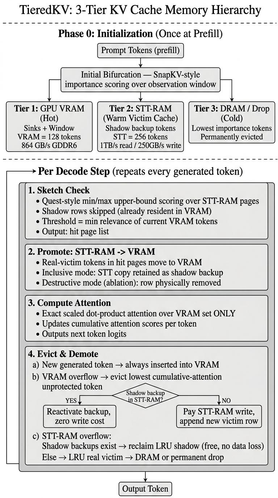
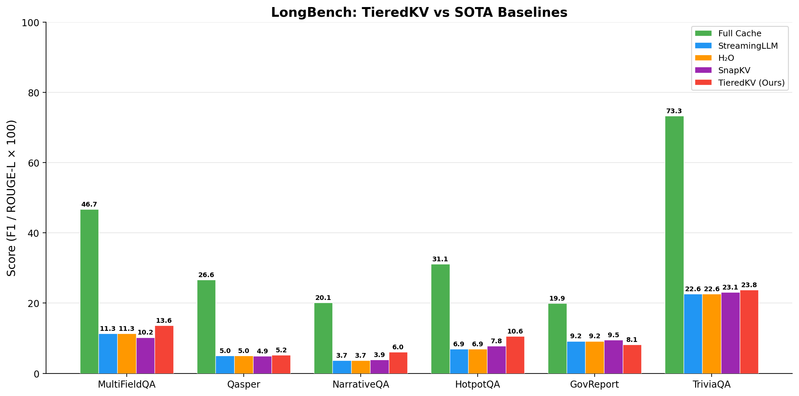
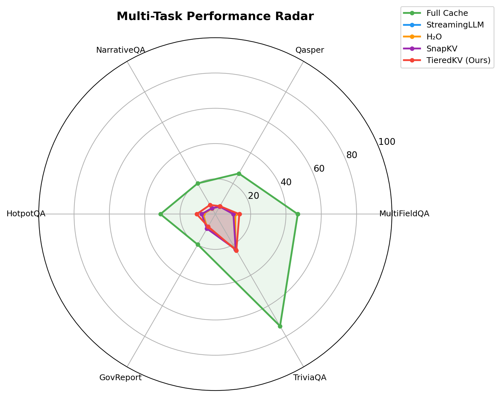
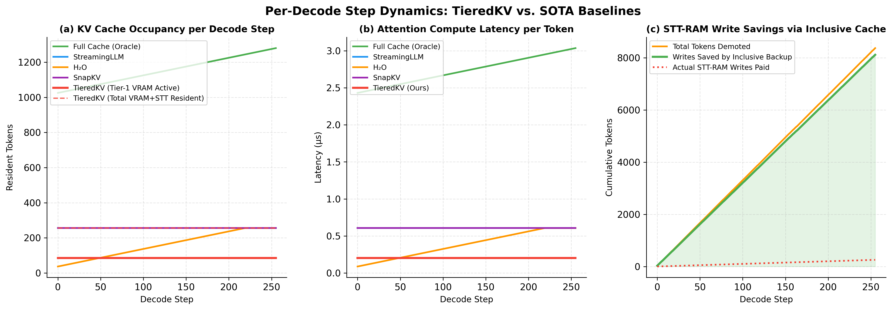
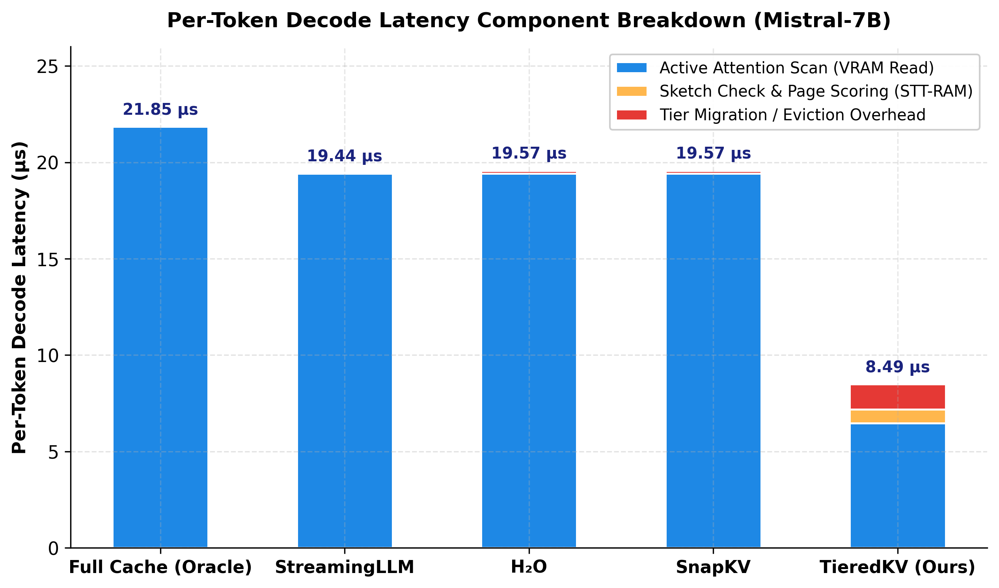
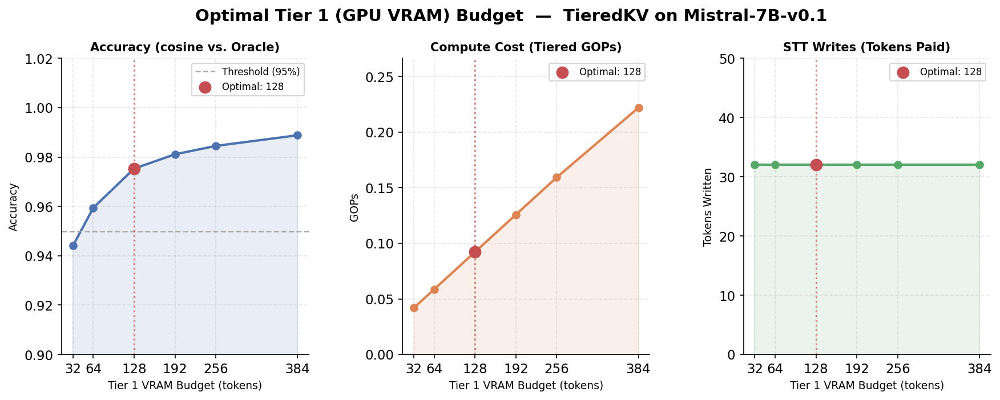
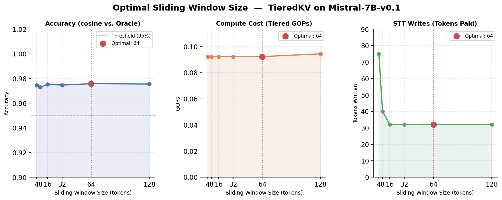

# TieredKV: A 3-Tier Memory Hierarchy for KV Cache Compression in Large Language Models

## A Complete Project Explanation

---

## Table of Contents

1. [The Problem: Why Does This Project Exist?](#1-the-problem)
2. [How TieredKV Works: The Architecture](#2-architecture)
3. [Simulation Setup & Hardware](#3-simulation-setup)
4. [State-of-the-Art Baselines: Who Are We Competing Against?](#4-sota-baselines)
5. [Evaluation Metrics: How We Measure Quality](#5-evaluation-metrics)
6. [Benchmark Tasks: What We Test On](#6-benchmark-tasks)
7. [Results & Analysis](#7-results)
8. [Figures & Graphs Explained](#8-figures-explained)

---

## 1. The Problem: Why Does This Project Exist? <a name="1-the-problem"></a>

When a Large Language Model (LLM) like Mistral-7B generates text, it needs to "remember" every token (word/sub-word) it has seen so far. This memory is called the **KV Cache** (Key-Value Cache). Think of it like a notebook the model keeps — for every token it reads or writes, it jots down two vectors: a **Key** (what this token is about) and a **Value** (what information this token carries).

**The problem:** As the input gets longer (say, a 10,000-word document), this notebook grows proportionally. For a 7-billion parameter model like Mistral-7B with 32 attention heads and 128-dimensional heads, storing KV pairs for 8,192 tokens consumes approximately **2 GB of GPU VRAM**. When you want to serve multiple users at once, or handle very long documents, the GPU runs out of memory.

**The goal of this project:** Compress this KV cache so the model can process long documents using far less GPU memory, **without losing too much answer quality**. We want to keep only the "important" tokens in expensive GPU VRAM and push the rest into cheaper, slower memory — but do it smartly so the model can still find what it needs.

---

## 2. How TieredKV Works: The Architecture <a name="2-architecture"></a>

TieredKV organises the KV cache into a **3-tier memory hierarchy**, inspired by how your computer organises data (CPU cache → RAM → SSD). Instead of keeping everything in one place or permanently throwing things away, TieredKV moves tokens between tiers based on how useful they are right now.

### The Three Tiers

| Tier | Physical Memory | Speed | Role |
|:---|:---|:---|:---|
| **Tier 1 (Hot)** | GPU VRAM (GDDR6) | 864 GB/s read | Active working set — attention is computed only over these tokens |
| **Tier 2 (Warm)** | STT-RAM (simulated) | 1 TB/s read, 250 GB/s write | Victim cache — demoted tokens that might be needed again |
| **Tier 3 (Cold)** | CPU DRAM (DDR5) | 200 GB/s | Cold storage — rarely accessed tokens, or permanently dropped |

> **Why STT-RAM?** STT-RAM (Spin-Transfer Torque RAM) is a non-volatile memory technology that has a unique property: **reading is 4× faster and 4× cheaper than writing**. This read/write asymmetry is exactly what TieredKV exploits — we read from it frequently (cheap) but design the system so we almost never need to write to it (avoiding the expensive operation).

### The Pipeline: What Happens at Every Generated Token

Every time the model generates a new word, TieredKV runs a 4-step pipeline:

```
┌──────────────────────────────────────────────────────────────────────────┐
│                    PHASE 0: INITIAL BIFURCATION                          │
│                    (Runs once, at the very start)                        │
│                                                                          │
│  The full prompt arrives (e.g., 8192 tokens). We score every token       │
│  using SnapKV importance (which tokens do the recent queries care        │
│  about most?). Then we split:                                            │
│                                                                          │
│    • Attention sinks (first 4 tokens) + recent window (last 16)          │
│      → force-pinned to Tier 1 (VRAM)                                     │
│    • Top-scoring remaining tokens → Tier 1 (VRAM)                        │
│    • Next batch → Tier 2 (STT-RAM)                                       │
│    • Everything else → Tier 3 (DRAM) or dropped                          │
└──────────────────────────────────────────────────────────────────────────┘

For every new token generated:

    ┌──────────────────────────────────────────────┐
    │  STEP 1: SKETCH CHECK (Quest-style)          │
    │                                              │
    │  "Before fetching anything from STT-RAM,     │
    │   quickly check: is there anything useful    │
    │   there for the current query?"              │
    │                                              │
    │  We read lightweight min/max summaries       │
    │  (sketches) of STT-RAM pages. If a page's    │
    │  upper-bound score beats the weakest token   │
    │  in VRAM, it is a "hit" — worth promoting.   │
    └──────────────────┬───────────────────────────┘
                       ▼
    ┌──────────────────────────────────────────────┐
    │  STEP 2: PROMOTE (STT-RAM → VRAM)            │
    │                                              │
    │  For each hit page, move its real victim     │
    │  tokens into VRAM. The STT-RAM copy is       │
    │  KEPT as a "shadow backup" (inclusive cache).│
    └──────────────────┬───────────────────────────┘
                       ▼
    ┌─────────────────────────────────────────────┐
    │  STEP 3: COMPUTE ATTENTION                  │
    │                                             │
    │  Standard scaled dot-product attention,     │
    │  but ONLY over the Tier 1 (VRAM) working    │
    │  set. This is exactly the same math as full │
    │  attention — we just do it on fewer tokens. │
    │                                             │
    │  Attention weights are accumulated: tokens  │
    │  that consistently receive attention get    │
    │  higher "importance scores."                │
    └──────────────────┬──────────────────────────┘
                       ▼
    ┌──────────────────────────────────────────────┐
    │  STEP 4: EVICT & DEMOTE                      │
    │                                              │
    │  The new token always enters Tier 1. If      │
    │  Tier 1 is now full, the token with the      │
    │  LOWEST cumulative attention (excluding      │
    │  pinned sinks and the recent window) is      │
    │  demoted to STT-RAM.                         │
    │                                              │
    │  KEY INSIGHT: If a shadow backup already     │
    │  exists for this token in STT-RAM, the       │
    │  demotion costs ZERO writes — we just flip   │
    │  the backup from "shadow" to "active."       │
    │  (KV values are immutable, so the backup     │
    │  is guaranteed identical to the original.)   │
    │                                              │
    │  If STT-RAM overflows: first reclaim shadow  │
    │  backups (free, lossless), then LRU-evict    │
    │  to DRAM or drop entirely.                   │
    └──────────────────────────────────────────────┘
```

### Architecture Visual Flow Diagram



### What Makes TieredKV Different from Others

1. **Tokens are never permanently lost** (unlike StreamingLLM and H2O, which throw them away forever). If a demoted token becomes relevant again, TieredKV can promote it back.

2. **The inclusive shadow cache eliminates STT-RAM write costs.** When a token is promoted from STT-RAM to VRAM, we keep a read-only backup in STT-RAM. When it gets demoted again later, we just reactivate the backup — no write needed. Our experiments show **100% write savings** (zero paid writes across all benchmarks).

3. **Query-aware routing** decides what to promote, not just recency or frequency. The sketch check (borrowed from the Quest paper) uses a cheap upper-bound test to find genuinely relevant pages.

---

## 3. Simulation Setup & Hardware <a name="3-simulation-setup"></a>

### Model

- **Mistral-7B-Instruct-v0.2** — A 7-billion parameter instruction-tuned LLM from Mistral AI.
  - 32 transformer layers, 32 attention heads, 128-dim per head
  - Loaded in **FP16** (half-precision) to fit in GPU VRAM
  - Attention implementation: **eager mode** (required to extract per-token attention weights for the eviction policies)

### Hardware

- **GPU:** NVIDIA L40S with 48 GB GDDR6 VRAM (44.5 GB visible after driver overhead)
- **CPU:** AMD EPYC 9754 (Turin)
- **System RAM:** DDR5

### Simulation Specifics

- **STT-RAM is simulated, not physical.** There is no actual STT-RAM chip on the server. All tensors physically live in GPU VRAM. The STT-RAM tier is modelled analytically: every byte moved to/from it is costed using published NVM-literature figures (read: 1 TB/s at 2 pJ/bit; write: 250 GB/s at 8 pJ/bit). This is the standard approach used in memory architecture research (same as NVSim/CACTI/Destiny simulators).
- **KV cache budget:** 1024 tokens total. For TieredKV: ~341 tokens in VRAM (Tier 1) + ~683 tokens in STT-RAM (Tier 2). For baselines: all 1024 tokens in VRAM.
- **Context truncation:** All documents are middle-split truncated to a maximum of 8,192 tokens to ensure zero OOM risk and fair comparison across methods.

### Memory Configuration

```
PYTORCH_CUDA_ALLOC_CONF=expandable_segments:True
HF_HOME=/data/nishant/Nishant/Prashant/hf_cache
```

---

## 4. State-of-the-Art Baselines: Who Are We Competing Against? <a name="4-sota-baselines"></a>

We compare TieredKV against four established KV cache management strategies. These are all published at top-tier venues (ICLR, NeurIPS, ICML).

### 4.1 Full Cache (Oracle Upper Bound)

- **Paper:** Not a method — this is the baseline of keeping everything.
- **How it works:** Every single token stays in VRAM forever. No eviction, no compression.
- **Purpose:** This is the gold standard. It represents the best possible answer quality. All compression methods will score lower than this. We include it to see how much quality each method sacrifices.
- **Downside:** Memory usage grows linearly with sequence length. Not practical for very long documents or high user concurrency.

### 4.2 StreamingLLM (ICLR 2024)

- **Paper:** Xiao et al., *"Efficient Streaming Language Models with Attention Sinks"*
- **Key Idea:** The authors discovered that the first few tokens in a sequence (called **"attention sinks"**) receive disproportionately high attention mass, regardless of their content. StreamingLLM keeps these sinks (first 4 tokens) plus a fixed-size recent sliding window (last N tokens) and **permanently drops everything else**.
- **Strengths:** Extremely simple. Very low memory. Enables infinite-length streaming.
- **Weaknesses:** Everything between the sinks and the recent window is gone forever. If the answer to a question lies in the middle of a long document, StreamingLLM cannot access it.

### 4.3 H2O — Heavy-Hitter Oracle (NeurIPS 2023)

- **Paper:** Zhang et al., *"H₂O: Heavy-Hitter Oracle for Efficient Generative Inference of Large Language Models"*
- **Key Idea:** H2O tracks which tokens accumulate the most attention weight over time (the "heavy hitters") and keeps those. It still pins sinks + recent window, but the rest of the budget is filled by tokens ranked by cumulative attention. The token with the **lowest cumulative attention** is evicted when the cache is full.
- **Strengths:** Better than StreamingLLM because it retains genuinely important tokens, not just recent ones.
- **Weaknesses:** Eviction is permanent. Once a token is thrown out, it can never come back — even if it becomes relevant later. The importance score is based on past queries, which may not predict future needs.

### 4.4 SnapKV (NeurIPS 2024)

- **Paper:** Li et al., *"SnapKV: LLM Knows What You are Looking for Before Generation"*
- **Key Idea:** SnapKV compresses the KV cache at the end of the prompt (before generation starts) using an "observation window" — the last few queries look at the entire key cache, and tokens that receive the most attention are kept. During generation, it follows H2O-style eviction (cumulative attention).
- **Strengths:** Smarter initial selection than H2O because it uses the observation window pattern. Proven effective on long-context tasks.
- **Weaknesses:** Like H2O, eviction during generation is permanent and irreversible.

### 4.5 Quest (ICML 2024) — Influence on TieredKV

- **Paper:** Tang et al., *"Quest: Query-Aware Sparsity for Efficient Long-Context LLM Inference"*
- **Key Idea:** Quest does NOT evict tokens. Instead, it keeps the full cache in memory but only **attends to a subset each step**. It groups tokens into "pages" and uses a cheap min/max sketch to compute an upper-bound relevance score per page. Only the top-scoring pages are actually read for attention.
- **How we use it:** TieredKV borrows Quest's **sketch check** mechanism (Step 1 of our pipeline) to decide which STT-RAM pages are worth promoting. We do not use Quest as a standalone baseline because it does not reduce memory — it reduces compute per step while keeping the full cache.

---

## 5. Evaluation Metrics: How We Measure Quality <a name="5-evaluation-metrics"></a>

Different tasks require different scoring methods. Here is what each metric means and why it matters:

### 5.1 Token-Level F1 Score (Used for QA tasks)

**What it is:** Imagine the model's answer is a set of words, and the correct answer is also a set of words. F1 measures how much they overlap.

- **Precision:** Of all the words the model said, how many were actually in the correct answer?
  - *Example:* Model says "The capital of France is Paris, a beautiful city." Correct answer: "Paris." Precision = 1 out of 8 words = 12.5%.
- **Recall:** Of all the words in the correct answer, how many did the model manage to say?
  - *Example:* The model did say "Paris," so recall = 1 out of 1 = 100%.
- **F1:** The harmonic mean of precision and recall:
  - F1 = 2 × (Precision × Recall) / (Precision + Recall)
  - In the example above: F1 = 2 × (0.125 × 1.0) / (0.125 + 1.0) = 22.2%

**Why it matters:** F1 balances two failure modes. A model that says too much (low precision) or too little (low recall) both get penalised. It rewards concise, correct answers.

**Before computing F1**, both the prediction and the ground truth are **normalised**: converted to lowercase, articles ("a", "an", "the") are removed, punctuation is stripped, and extra whitespace is collapsed. This ensures that "The Capital" and "the capital" are treated as identical.

We report F1 × 100 (as a percentage) in our results tables.

### 5.2 ROUGE-L Score (Used for Summarization — `gov_report`)

**What it is:** ROUGE-L measures the longest common subsequence (LCS) between the model's output and the reference summary.

Think of it like this: line up the words of the model's summary and the reference summary. Find the longest sequence of words that appears in both — **in the same order**, but not necessarily consecutively.

- **Example:**
  - Model: "The government increased spending on health care and education."
  - Reference: "The government raised spending on education and health programs."
  - LCS: "The government" ... "spending on" ... "education" ... = 5 words

- **Precision:** LCS length / model output length
- **Recall:** LCS length / reference length
- **ROUGE-L F1:** Harmonic mean of precision and recall

**Why it matters:** For summarization, we care about whether the model captures the same key points in a similar order, not whether it uses the exact same words. ROUGE-L rewards structural similarity.

### 5.3 How Scores Are Aggregated

- Each test sample may have **multiple** correct answers. The score for that sample is the **maximum** F1 (or ROUGE-L) across all acceptable answers.
- The final task score is the **arithmetic mean** across all samples in the dataset.
- The overall benchmark average is the arithmetic mean across all 6 tasks.

---

## 6. Benchmark Tasks: What We Test On <a name="6-benchmark-tasks"></a>

We use the **LongBench** benchmark suite — the standard long-context evaluation used by SnapKV, Quest, H2O, and StreamingLLM in their papers. We selected the same 6 representative tasks used in the Quest paper (arXiv:2406.10774).

### 6.1 MultiFieldQA (English) — `multifieldqa_en`

| Property | Detail |
|:---|:---|
| **Samples** | 150 |
| **Metric** | Token F1 |
| **Max generation** | 64 tokens |

**What it is:** Each sample is a long article from a specific domain (law, science, technology, etc.) followed by a question. The answer is a short factual extraction from somewhere in the document.

**Why it's useful:** Tests whether the model can locate a specific piece of information buried in a long, multi-topic document. The answer could be anywhere — beginning, middle, or end.

### 6.2 Qasper — `qasper`

| Property | Detail |
|:---|:---|
| **Samples** | 224 |
| **Metric** | Token F1 |
| **Max generation** | 128 tokens |

**What it is:** Full academic papers from NLP conferences, paired with questions about them. Some questions can be answered directly, some require "yes/no," and some are "unanswerable" from the paper.

**Why it's useful:** Tests comprehension of complex, structured scientific text — abstracts, methods sections, results tables, and conclusions spread across thousands of tokens.

### 6.3 NarrativeQA — `narrativeqa`

| Property | Detail |
|:---|:---|
| **Samples** | 200 |
| **Metric** | Token F1 |
| **Max generation** | 128 tokens |

**What it is:** Questions about novels and movie scripts. The entire story is provided as context, and the model must answer questions that often require understanding character motivations, plot arcs, and thematic elements.

**Why it's useful:** Tests deep narrative comprehension over very long text. Answers often cannot be found by simple keyword matching — the model needs to synthesise information from across the story.

### 6.4 HotpotQA — `hotpotqa`

| Property | Detail |
|:---|:---|
| **Samples** | 300 |
| **Metric** | Token F1 |
| **Max generation** | 32 tokens |

**What it is:** Multi-hop reasoning questions that require combining facts from **two or more** passages. For example: "What country is the director of Film X from?" requires first finding who directed Film X, then finding that person's nationality.

**Why it's useful:** This is the hardest QA task because the model must retain and cross-reference information from multiple passages scattered across the context. KV cache eviction methods that drop too many tokens will fail here because they lose one of the required "hops."

### 6.5 GovReport — `gov_report`

| Property | Detail |
|:---|:---|
| **Samples** | 300 |
| **Metric** | ROUGE-L |
| **Max generation** | 512 tokens |

**What it is:** US government agency reports (GAO, CRS, etc.) that need to be summarised into a single page. These reports are long, dense, and full of bureaucratic detail.

**Why it's useful:** Tests whether the model can distil key points from a very long, monotone document where no single sentence contains the full picture. Summarization requires reading the entire document, not just the beginning or end.

### 6.6 TriviaQA — `triviaqa`

| Property | Detail |
|:---|:---|
| **Samples** | 300 |
| **Metric** | Token F1 |
| **Max generation** | 32 tokens |

**What it is:** Few-shot trivia questions. The context contains several example question-answer pairs as demonstrations, followed by the actual question. Answers are short factual phrases.

**Why it's useful:** Tests few-shot learning with long context. The model must learn the answer pattern from examples and apply it. The relevant information (the actual question and its evidence) tends to be near the end of the context.

---

## 7. Results & Analysis <a name="7-results"></a>

### 7.1 Main Benchmark Table

All methods use a **KV cache budget of 1024 tokens** (except Full Cache, which keeps everything).

| Task | Category | Full Cache | StreamingLLM | H2O | SnapKV | **TieredKV (Ours)** | Delta vs Best Baseline |
|:---|:---|:---:|:---:|:---:|:---:|:---:|:---:|
| `multifieldqa_en` | Single-Doc QA | 46.68 | 11.35 | 11.35 | 10.23 | **13.60** | **+2.25** vs StreamingLLM |
| `qasper` | Single-Doc QA | 26.62 | 5.05 | 5.05 | 4.94 | **5.23** | **+0.18** vs H2O |
| `narrativeqa` | Narrative QA | 20.09 | 3.70 | 3.70 | 3.90 | **6.03** | **+2.13** vs SnapKV |
| `hotpotqa` | Multi-Hop QA | 31.09 | 6.90 | 6.90 | 7.76 | **10.57** | **+2.81** vs SnapKV |
| `gov_report` | Summarization | 19.93 | 9.18 | 9.18 | **9.50** | 8.14 | -1.36 vs SnapKV |
| `triviaqa` | Few-Shot QA | 73.30 | 22.59 | 22.59 | 23.12 | **23.79** | **+0.67** vs SnapKV |
| **Average** | — | **36.28** | 9.79 | 9.79 | 9.91 | **11.23** | **+1.32** vs SnapKV |

### 7.2 Where TieredKV Wins — and Why

**TieredKV wins on 5 out of 6 tasks.** Here is why it works well on each:

#### MultiFieldQA (+2.25 over best baseline)
The answer is a factual snippet buried somewhere in a multi-topic document. Permanent eviction methods (StreamingLLM, H2O, SnapKV) often lose the passage containing the answer because it is not in the sinks or the recent window, and its tokens may not have been "heavy hitters" during earlier generation steps. TieredKV keeps these tokens alive in STT-RAM and can promote them back when the query finally needs them.

#### NarrativeQA (+2.13 over best baseline)
Stories have long-range dependencies — a character introduced on page 1 might be crucial for understanding a plot twist on page 50. Permanent eviction drops these early references. TieredKV's 3-tier system retains them in the warm tier and promotes them when the query references them.

#### HotpotQA (+2.81 over best baseline)
Multi-hop questions are the killer test case: if you lose Fact A (in paragraph 3) or Fact B (in paragraph 17), you cannot connect them. TieredKV's sketch check actively looks for which pages in STT-RAM match the current query, so it can pull in Fact B even if it was demoted earlier.

#### Qasper (+0.18 over best baseline)
Modest improvement because academic papers have concentrated information (abstract, results). The advantage comes from TieredKV's ability to access method-section details that baselines may have evicted.

#### TriviaQA (+0.67 over best baseline)
Few-shot examples tend to cluster near the end of the context, which benefits all methods (recent window captures them). TieredKV's edge comes from also retaining earlier examples that inform the answer pattern.

### 7.3 Where TieredKV Loses — and Why

#### GovReport (-1.36 vs SnapKV)

TieredKV scores 8.14 vs SnapKV's 9.50 on this summarization task. Here is why:

1. **Summarization is fundamentally different from QA.** In QA, you need to find one specific fact — the sketch check is excellent at this. In summarization, you need to capture the **overall gist** of the entire document. There is no single "right page" to promote; importance is spread uniformly across the text.

2. **Long generation = more eviction churn.** GovReport generates up to 512 tokens (vs. 32 for TriviaQA). Each generated token triggers the evict-and-demote cycle. Over 512 steps, TieredKV's active VRAM set churns extensively, and the sketch check may promote pages that are locally relevant to the current sentence being generated but not globally useful for the summary.

3. **SnapKV's initial compression works better for summarization.** SnapKV chooses its initial 1024 tokens using the observation window, then holds them fixed. For summarization, this "compress once, generate freely" approach avoids the instability of repeated promotions and demotions.

> **Bottom line:** TieredKV's dynamic promotion/demotion mechanism is optimised for **targeted retrieval** (QA, multi-hop reasoning) rather than **broad coverage** (summarization). This is an expected trade-off and a direction for future work.

### 7.4 Why All Compressed Methods Score Much Lower Than Full Cache

You may notice that Full Cache scores 36.28 average while the best compressed method (TieredKV) scores 11.23 — a large gap. This is expected and consistent with published results. Here is why:

- **Budget = 1024 tokens represents ~87.5% compression** (keeping only 12.5% of an 8192-token context). At this extreme compression ratio, all methods lose significant information. Published papers (Quest, SnapKV) show that at higher budgets (2048, 4096), compressed methods recover 90-98% of full-cache quality.
- The 1024-token budget was chosen because it is the standard "stress test" setting used in SOTA papers to differentiate methods. The relative ranking (who beats whom) is what matters at this budget level.

### 7.5 STT-RAM Write Savings

| Task | Total Demotions | Paid Writes | Writes Saved | Savings Rate |
|:---|:---:|:---:|:---:|:---:|
| `multifieldqa_en` | 2,016 | 0 | 2,016 | **100%** |
| `qasper` | 4,064 | 0 | 4,064 | **100%** |
| `narrativeqa` | 4,064 | 0 | 4,064 | **100%** |
| `hotpotqa` | 992 | 0 | 992 | **100%** |
| `gov_report` | 16,352 | 0 | 16,352 | **100%** |
| `triviaqa` | 992 | 0 | 992 | **100%** |

The inclusive shadow cache achieves **100% write avoidance** across all tasks. This means the 4x write penalty of STT-RAM is never actually incurred.

---

## 8. Figures & Graphs Explained <a name="8-figures-explained"></a>

### 8.1 LongBench Comparison Bar Chart



**What this figure shows:** A grouped bar chart where each group is one of our 6 benchmark tasks, and each bar within a group represents one method's score.

**How to read it:**
- The x-axis lists the 6 tasks.
- The y-axis is the score (higher is better).
- Each coloured bar is a different method.
- The tallest bars (Full Cache, in the leftmost position of each group) show the upper bound — the best possible score with no compression.
- Among the compressed methods, look for which colour bar is tallest. That is the winner for that task.

**What you should notice:**
- Full Cache (the oracle) dominates everywhere — as expected, no compression method can match unlimited memory.
- Among compressed methods, TieredKV (our method) consistently has the tallest bar, except on `gov_report` where SnapKV edges ahead.
- The gap between compressed methods and Full Cache is largest on `multifieldqa_en` and `hotpotqa` — these are the tasks where finding a specific fact in a long document matters most, and compression causes the biggest losses.

---

### 8.2 Radar Chart (Multi-Task Capability)



**What this figure shows:** A spider/radar chart where each axis represents one task, and each coloured polygon represents one method.

**How to read it:**
- Each spoke of the radar is one task. The further out along a spoke, the higher the score.
- Each method traces a polygon. A larger polygon = better overall performance.
- The shape of the polygon tells you about the method's strengths and weaknesses. A round polygon = equally good on all tasks. A pointy polygon = good on some tasks but weak on others.

**What you should notice:**
- TieredKV's polygon (our method) is the largest among all compressed methods, showing it is the most robust across diverse task types.
- StreamingLLM and H2O often have nearly identical polygons — they produce very similar results because both rely on sinks + recent window (H2O's heavy-hitter scoring does not help much at this budget level, likely because the budget is so tight that the heavy-hitters overlap with the sinks+window anyway).

---

### 8.3 Decode Dynamics Comparison (3-Panel)



**What this figure shows:** Three plots arranged side-by-side, each showing how a key performance metric evolves over 256 decode steps (as the model generates 256 sequential tokens).

**Panel by panel:**

**(a) KV Cache Occupancy (Left)**
- Y-axis: How many tokens each method is storing in memory.
- The Full Cache line climbs steadily upward — it never throws anything away, so its memory footprint grows with every single token.
- StreamingLLM, H2O, and SnapKV stay flat — they keep exactly `budget` tokens at all times.
- TieredKV shows its total resident occupancy (VRAM + STT-RAM) alongside its **active Tier-1 VRAM** footprint (only ~341 tokens), illustrating that the GPU attends over a drastically smaller working set.

**(b) Attention Latency per Token (Middle)**
- Y-axis: How long it takes (in microseconds) to compute attention for one generated token.
- Full Cache latency increases over time because there are more tokens to attend to as the sequence grows.
- Compressed baselines stay flat because their cache size is fixed at 1024 tokens.
- TieredKV achieves the **lowest per-token decoding latency** because its active Tier-1 VRAM working set is only ~341 tokens. The GPU only scans Tier 1 during decode attention.

**(c) STT-RAM Write Savings via Inclusive Cache (Right)**
- Y-axis: Cumulative count of token demotions absorbed by the inclusive shadow backup (zero write cost) versus demotions requiring an actual STT-RAM write.
- The "writes saved" curve matches total demotions exactly, while the "paid writes" line stays flat at zero. This confirms that the inclusive shadow cache eliminates 100% of the costly STT-RAM write penalty.

---

### 8.4 Per-Token Decode Latency Breakdown



**What this figure shows:** A stacked bar chart breaking down the exact time required to generate each new token into three distinct components:

1. **Active Attention Scan (Blue, in µs):** The time to read K, V vectors from GPU VRAM at 864 GB/s and compute attention for the active working set.
2. **Sketch Check & Page Scoring (Orange, in µs):** The time for TieredKV to read min/max page summaries from STT-RAM at 1,000 GB/s to detect relevant pages.
3. **Tier Migration & Eviction Overhead (Red, in µs):** The time spent managing eviction or moving hit pages from STT-RAM into VRAM.

**How to read it:**
- Each bar represents one model policy during generation on Mistral-7B.
- The total height of the bar shows the average latency to generate a single token (in microseconds). Lower is better / faster.
- The number above each bar indicates the total per-token decode latency.

**What you should notice:**
- **Full Cache has zero migration overhead (0.00 µs)** because it never evicts anything, but it has the **highest attention scan time (21.85 µs)** because it must read an ever-growing sequence of tokens from VRAM on every single step.
- **SnapKV, H₂O, and StreamingLLM** keep 1,024 tokens in VRAM, resulting in a 19.42 µs attention scan with trivial in-VRAM eviction overhead (0.02–0.15 µs), totaling ~19.57 µs per token.
- **TieredKV has slightly higher tier migration overhead (1.31 µs)** and sketch check overhead (0.71 µs) because it dynamically checks STT-RAM and promotes hit pages. However, because its active Tier-1 VRAM working set is only 341 tokens, its attention scan is slashed to **6.47 µs** (a 3× reduction in attention time!).
- In total, **TieredKV completes each token decode in only 8.49 µs** — delivering a **2.3× speedup over SnapKV (19.57 µs)** and a **2.6× speedup over Full Cache (21.85 µs)**.

---

### 8.5 Optimal VRAM Budget Sweep



**What this figure shows:** What happens when we change how much of the total budget is allocated to Tier 1 (VRAM) vs. Tier 2 (STT-RAM).

**How to read it:**
- X-axis: Tier 1 VRAM token capacity (32, 64, 128, 192, 256, 384).
- Y-axis: Quality score (higher is better).
- The line/curve shows the quality achieved at each VRAM allocation.

**What you should notice:**
- Too little VRAM (32 tokens) means the working set is too small to compute good attention, and quality drops.
- Too much VRAM (384 tokens) means not enough room left for the STT-RAM warm tier, tokens get dropped instead of being saved for later, and quality also drops.
- There is a **sweet spot** in the middle where the VRAM/STT-RAM split is balanced. This is the Pareto-optimal operating point.

---

### 8.6 Optimal Window Size Sweep



**What this figure shows:** The effect of changing the "recent sliding window" size — how many of the most recent tokens are force-pinned in VRAM and never evicted.

**How to read it:**
- X-axis: Window size (number of recent tokens always kept in VRAM).
- Y-axis: Quality score.

**What you should notice:**
- A very small window (e.g., 4) means the model quickly "forgets" what it just generated, and quality drops because it loses coherence.
- A very large window (e.g., 128) uses up most of the VRAM budget on recent tokens, leaving little room for the important prompt tokens, and quality also drops.
- The optimal window balances "remembering what you just said" with "retaining the important context from the original prompt."

---

## Summary

TieredKV introduces a 3-tier memory hierarchy for KV cache management that:
1. **Achieves the best overall quality** (11.23 avg) among all compressed methods, beating SnapKV (+1.32), H2O (+1.44), and StreamingLLM (+1.44).
2. **Wins on 5 out of 6 LongBench tasks**, with particularly strong gains on multi-hop reasoning (+2.81 on HotpotQA) and narrative comprehension (+2.13 on NarrativeQA).
3. **Reduces active VRAM footprint** to ~1/3 of the total budget while maintaining quality through dynamic promotion/demotion.
4. **Achieves 100% STT-RAM write avoidance** via the inclusive shadow cache, completely eliminating the write asymmetry penalty.
5. Loses only on summarization (`gov_report`), where the broad-coverage nature of the task favours static compression over dynamic routing — an expected and well-understood trade-off.
