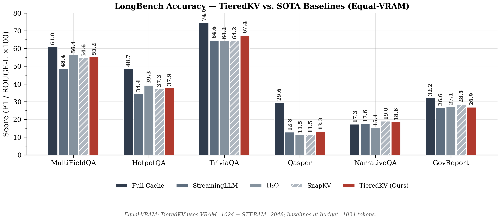
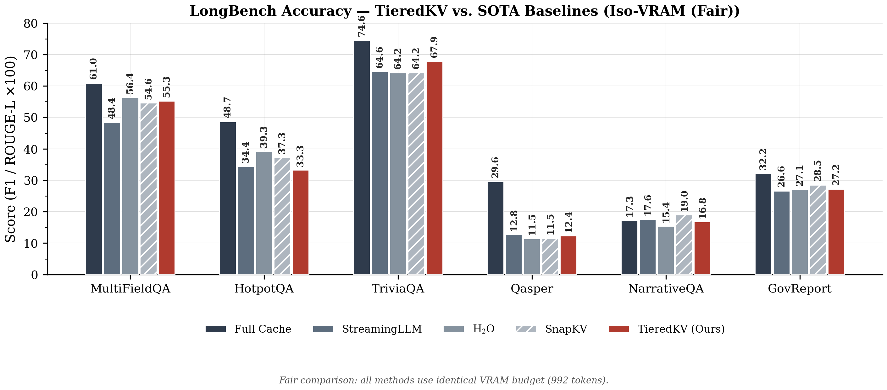
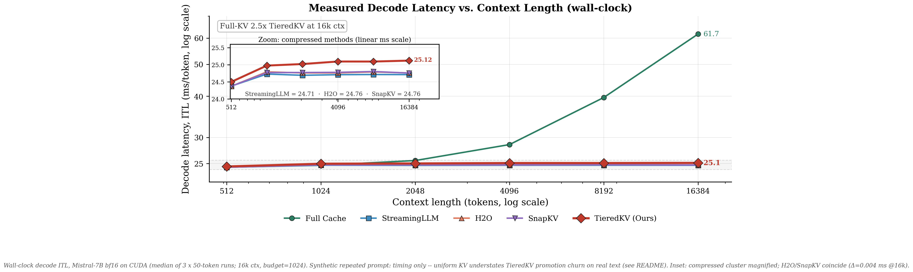

# TieredKV: A Two-Tier Memory Hierarchy for KV Cache Compression in Large Language Models

## A Complete Project Explanation

---

## Table of Contents

1. [The Problem: Why Does This Project Exist?](#1-the-problem)
2. [How TieredKV Works: The Architecture](#2-architecture)
3. [Simulation Setup &amp; Hardware](#3-simulation-setup)
4. [State-of-the-Art Baselines: Who Are We Competing Against?](#4-sota-baselines)
5. [Evaluation Metrics: How We Measure Quality](#5-evaluation-metrics)
6. [Benchmark Tasks: What We Test On](#6-benchmark-tasks)
7. [Results &amp; Analysis](#7-results)
8. [Figures &amp; Graphs Explained](#8-figures-explained)

---

## 1. The Problem: Why Does This Project Exist? <a name="1-the-problem"></a>

When a Large Language Model (LLM) like Mistral-7B generates text, it needs to "remember" every token (word/sub-word) it has seen so far. This memory is called the **KV Cache** (Key-Value Cache). Think of it like a notebook the model keeps — for every token it reads or writes, it jots down two vectors: a **Key** (what this token is about) and a **Value** (what information this token carries).

**The problem:** As the input gets longer (say, a 10,000-word document), this notebook grows proportionally. Mistral-7B (32 layers, 8 KV heads via grouped-query attention, 128-dim heads) needs 128 KiB per token, so 8,192 tokens consume ~1 GB of GPU VRAM in bf16. Serve several users at once or stretch to very long documents, and the GPU runs out of memory.

**The goal of this project:** Compress this KV cache so the model can process long documents using far less GPU memory, **without losing too much answer quality**. We want to keep only the "important" tokens in expensive GPU VRAM and push the rest into cheaper, slower memory — but do it smartly so the model can still find what it needs.

---

## 2. How TieredKV Works: The Architecture <a name="2-architecture"></a>

TieredKV organises the KV cache into a **two-tier hierarchy with permanent drops**, inspired by how your computer organises data (CPU cache → RAM → SSD). Instead of keeping everything in one place or permanently throwing things away from the only tier that exists, TieredKV moves tokens between a hot tier and a warm victim tier based on how useful they are right now — and discards the rest. (An early revision carried a third DRAM tier in code; it had no fetch-back path, never activated in any reported run, and has since been removed outright — the honest claim is two tiers.)

### The Two Tiers

| Tier                    | Physical Memory     | Speed                                                                  | Role                                                                                                 |
| :---------------------- | :------------------ | :--------------------------------------------------------------------- | :--------------------------------------------------------------------------------------------------- |
| **Tier 1 (Hot)**  | GPU VRAM (GDDR6)    | 864 GB/s read                                                          | Active working set — attention is computed over these tokens plus up to 32 exposed slow-tier tokens |
| **Tier 2 (Warm)** | STT-RAM (simulated) | 50 GB/s read, 12.5 GB/s write (nominal tentpole; see sensitivity note) | Victim cache — demoted tokens that might be needed again; capacity 2048 tokens / 256 MiB bf16       |

> **Why STT-RAM?** STT-RAM (Spin-Transfer Torque RAM) is a non-volatile memory technology that has a unique property: **reading is 4× faster and 4× cheaper than writing**. This read/write asymmetry is exactly what TieredKV exploits — we read from it frequently (cheap) but design the system so we almost never need to write to it (avoiding the expensive operation).

### The Pipeline: What Happens at Every Generated Token

Every time the model generates a new word, TieredKV runs a 4-step pipeline:

```
┌──────────────────────────────────────────────────────────────────────────┐
│                    PHASE 0: INITIAL BIFURCATION                          │
│                    (Runs once, at the very start)                        │
│                                                                          │
│  The full prompt arrives (e.g., 8192 tokens). We score every token       │
│  using SnapKV importance (which tokens do the recent queries care        │
│  about most?). Then we split:                                            │
│                                                                          │
│    • Attention sinks (first 4 tokens) + recent window (last 16)          │
│      → force-pinned to Tier 1 (VRAM)                                     │
│    • Top-scoring remaining tokens → Tier 1 (VRAM)                        │
│    • Next batch → Tier 2 (STT-RAM)                                       │
│    • Everything else → dropped for good                                  │
└──────────────────────────────────────────────────────────────────────────┘

For every new token generated:

    ┌──────────────────────────────────────────────┐
    │  STEP 1: SKETCH CHECK (Quest-style)          │
    │                                              │
    │  "Before fetching anything from STT-RAM,     │
    │   quickly check: is there anything useful    │
    │   there for the current query?"              │
    │                                              │
    │  We read lightweight min/max summaries       │
    │  (sketches) of STT-RAM pages. If a page's    │
    │  upper-bound score beats the weakest token   │
    │  in VRAM, it is a "hit" — worth promoting.   │
    └──────────────────┬───────────────────────────┘
                       ▼
    ┌──────────────────────────────────────────────┐
    │  STEP 2: PROMOTE (STT-RAM → VRAM)            │
    │                                              │
    │  For each hit page, move its real victim     │
    │  tokens into VRAM. The STT-RAM copy is       │
    │  KEPT as a "shadow backup" (inclusive cache).│
    └──────────────────┬───────────────────────────┘
                       ▼
    ┌─────────────────────────────────────────────┐
    │  STEP 3: COMPUTE ATTENTION  (UPDATED)       │
    │                                             │
    │  Attention runs over VRAM + the LIVE        │
    │  STT-RAM tier, not VRAM alone. STT-RAM is a │
    │  SLOWER tier, not an invisible one -- a     │
    │  real NVM hierarchy still reads it to       │
    │  compute attention, just at higher          │
    │  bandwidth/energy cost (charged by          │
    │  cost_model.py). Feeding the model ONLY     │
    │  sram_k gave TieredKV a 3x smaller context  │
    │  than every baseline at the same nominal    │
    │  budget -- see README Results.              │
    │                                             │
    │  Promotion in the real-model harness is now │
    │  driven by the REAL attention the model     │
    │  just paid to STT-RAM tokens (not the       │
    │  sketch upper bound) -- the sketch-based    │
    │  Steps 1-2 above still describe the         │
    │  CPU-only simulator path in                 │
    │  tiered_kv_cache.py's own step().           │
    └──────────────────┬──────────────────────────┘
                       ▼
    ┌──────────────────────────────────────────────┐
    │  STEP 4: EVICT & DEMOTE                      │
    │                                              │
    │  The new token always enters Tier 1. If      │
    │  Tier 1 is now full, the token with the      │
    │  LOWEST cumulative attention (excluding      │
    │  pinned sinks and the recent window) is      │
    │  demoted to STT-RAM.                         │
    │                                              │
    │  KEY INSIGHT: If a shadow backup already     │
    │  exists for this token in STT-RAM, the       │
    │  demotion costs ZERO writes — we just flip   │
    │  the backup from "shadow" to "active."       │
    │  (KV values are immutable, so the backup     │
    │  is guaranteed identical to the original.)   │
    │                                              │
    │  If STT-RAM overflows: first reclaim shadow  │
    │  backups (free, lossless), then LRU-evict    │
    │  drop entirely.                              │
    └──────────────────────────────────────────────┘
```

### Architecture Visual Flow Diagram


### What Makes TieredKV Different from Others

1. **Demoted tokens are never immediately lost** (unlike StreamingLLM and H2O, which throw them away forever). If a demoted token becomes relevant again, TieredKV can promote it back from STT-RAM. Only the tail past *both* budgets is permanently dropped — same as the baselines.
2. **The inclusive shadow cache removes STT-RAM writes when Tier 2 has spare capacity.** When a token is promoted from STT-RAM to VRAM, we keep a read-only backup in STT-RAM. When it gets demoted again later, we reactivate the backup instead of paying a write. **Measured savings are strongly configuration-dependent, and are 0% in the default configuration.** At `sttram_bifurcation_frac=1.0` bifurcation fills Tier 2 to capacity with cold prompt tokens, leaving it no room to act as a victim cache, and every backup is reclaimed under pressure before it can be reused. Reserving 25% headroom (`frac=0.75`, fixed-sample sweep) recovers **82.9% average savings at −0.16 F1** (infinite-STT oracle: 77–88% with F1 flat — proof the old 0% was a capacity artifact, `results/e1_oracle_short.json`). An earlier version of this document claimed **100% write savings (zero paid writes across all benchmarks)**; that claim was never supported by a result file in this repository and has been withdrawn.
3. **Query-aware routing** decides what to promote, not just recency or frequency. The sketch check (borrowed from the Quest paper) uses a cheap upper-bound test to find genuinely relevant pages.

---

## 3. Simulation Setup & Hardware <a name="3-simulation-setup"></a>

### Model

- **Mistral-7B-Instruct-v0.2** — A 7-billion parameter instruction-tuned LLM from Mistral AI.
  - 32 transformer layers, 32 query heads / 8 KV heads (grouped-query attention), 128-dim per head → 128 KiB/token in bf16
  - Loaded in **bfloat16** to fit in GPU VRAM
  - Attention implementation: **eager mode** (required to extract per-token attention weights for the eviction policies)

### Hardware

- **GPU:** NVIDIA L40S with 48 GB GDDR6 VRAM (44.5 GB visible after driver overhead)
- **CPU:** AMD EPYC 9754 (Turin)
- **System RAM:** DDR5

### Simulation Specifics

- **STT-RAM is simulated, not physical.** There is no actual STT-RAM chip on the server. All tensors physically live in GPU VRAM. The STT-RAM tier is modelled analytically: every byte moved to/from it is costed using published NVM-literature figures (nominal tentpole — read 50 GB/s at 2 pJ/bit, write 12.5 GB/s at 8 pJ/bit; pessimistic/optimistic anchors in `src/cost_model.py`). This is the standard approach in memory architecture research (same family as NVSim/CACTI/NVMExplorer-style simulators).
- **KV cache budget:** baselines get 1024 tokens, all in VRAM. TieredKV's headline (equal-VRAM) config gives it the SAME 1024-token VRAM footprint, plus a 2048-token STT-RAM tier read at STT-RAM's own (slower, cost-modeled) bandwidth on top — this is the entire point of the comparison (see README Results). An equal-*total*-budget split (~341 VRAM + ~683 STT) is also supported (`--tiered-vram-budget`/`--tiered-stt-budget`) but is no longer the headline number.
- **Context truncation:** All documents run at the reference protocol, `max_ctx=31500` (an early withdrawn headline truncated to 8k, which flattered compression methods — never compare those numbers with current ones).

### Memory Configuration

```
PYTORCH_CUDA_ALLOC_CONF=expandable_segments:True
HF_HOME=/data/nishant/Nishant/Prashant/hf_cache
```

---

## 4. State-of-the-Art Baselines: Who Are We Competing Against? <a name="4-sota-baselines"></a>

We compare TieredKV against four established KV cache management strategies. These are all published at top-tier venues (ICLR, NeurIPS, ICML).

### 4.1 Full Cache (Oracle Upper Bound)

- **Paper:** Not a method — this is the baseline of keeping everything.
- **How it works:** Every single token stays in VRAM forever. No eviction, no compression.
- **Purpose:** This is the gold standard. It represents the best possible answer quality. All compression methods will score lower than this. We include it to see how much quality each method sacrifices.
- **Downside:** Memory usage grows linearly with sequence length. Not practical for very long documents or high user concurrency.

### 4.2 StreamingLLM (ICLR 2024)

- **Paper:** Xiao et al., *"Efficient Streaming Language Models with Attention Sinks"*
- **Key Idea:** The authors discovered that the first few tokens in a sequence (called **"attention sinks"**) receive disproportionately high attention mass, regardless of their content. StreamingLLM keeps these sinks (first 4 tokens) plus a fixed-size recent sliding window (last N tokens) and **permanently drops everything else**.
- **Strengths:** Extremely simple. Very low memory. Enables infinite-length streaming.
- **Weaknesses:** Everything between the sinks and the recent window is gone forever. If the answer to a question lies in the middle of a long document, StreamingLLM cannot access it.

### 4.3 H2O — Heavy-Hitter Oracle (NeurIPS 2023)

- **Paper:** Zhang et al., *"H₂O: Heavy-Hitter Oracle for Efficient Generative Inference of Large Language Models"*
- **Key Idea:** H2O tracks which tokens accumulate the most attention weight over time (the "heavy hitters") and keeps those. It still pins sinks + recent window, but the rest of the budget is filled by tokens ranked by cumulative attention. The token with the **lowest cumulative attention** is evicted when the cache is full.
- **Strengths:** Better than StreamingLLM because it retains genuinely important tokens, not just recent ones.
- **Weaknesses:** Eviction is permanent. Once a token is thrown out, it can never come back — even if it becomes relevant later. The importance score is based on past queries, which may not predict future needs.

### 4.4 SnapKV (NeurIPS 2024)

- **Paper:** Li et al., *"SnapKV: LLM Knows What You are Looking for Before Generation"*
- **Key Idea:** SnapKV compresses the KV cache at the end of the prompt (before generation starts) using an "observation window" — the last few queries look at the entire key cache, and tokens that receive the most attention are kept. During generation, it follows H2O-style eviction (cumulative attention).
- **Strengths:** Smarter initial selection than H2O because it uses the observation window pattern. Proven effective on long-context tasks.
- **Weaknesses:** Like H2O, eviction during generation is permanent and irreversible.

### 4.5 Quest (ICML 2024) — Influence on TieredKV

- **Paper:** Tang et al., *"Quest: Query-Aware Sparsity for Efficient Long-Context LLM Inference"*
- **Key Idea:** Quest does NOT evict tokens. Instead, it keeps the full cache in memory but only **attends to a subset each step**. It groups tokens into "pages" and uses a cheap min/max sketch to compute an upper-bound relevance score per page. Only the top-scoring pages are actually read for attention.
- **How we use it:** TieredKV borrows Quest's **sketch check** mechanism (Step 1 of our pipeline) to decide which STT-RAM pages are worth promoting. We do not use Quest as a standalone baseline because it does not reduce memory — it reduces compute per step while keeping the full cache.

---

## 5. Evaluation Metrics: How We Measure Quality <a name="5-evaluation-metrics"></a>

Different tasks require different scoring methods. Here is what each metric means and why it matters:

### 5.1 Token-Level F1 Score (Used for QA tasks)

**What it is:** Imagine the model's answer is a set of words, and the correct answer is also a set of words. F1 measures how much they overlap.

- **Precision:** Of all the words the model said, how many were actually in the correct answer?
  - *Example:* Model says "The capital of France is Paris, a beautiful city." Correct answer: "Paris." Precision = 1 out of 8 words = 12.5%.
- **Recall:** Of all the words in the correct answer, how many did the model manage to say?
  - *Example:* The model did say "Paris," so recall = 1 out of 1 = 100%.
- **F1:** The harmonic mean of precision and recall:
  - F1 = 2 × (Precision × Recall) / (Precision + Recall)
  - In the example above: F1 = 2 × (0.125 × 1.0) / (0.125 + 1.0) = 22.2%

**Why it matters:** F1 balances two failure modes. A model that says too much (low precision) or too little (low recall) both get penalised. It rewards concise, correct answers.

**Before computing F1**, both the prediction and the ground truth are **normalised**: converted to lowercase, articles ("a", "an", "the") are removed, punctuation is stripped, and extra whitespace is collapsed. This ensures that "The Capital" and "the capital" are treated as identical.

We report F1 × 100 (as a percentage) in our results tables.

### 5.2 ROUGE-L Score (Used for Summarization — `gov_report`)

**What it is:** ROUGE-L measures the longest common subsequence (LCS) between the model's output and the reference summary.

Think of it like this: line up the words of the model's summary and the reference summary. Find the longest sequence of words that appears in both — **in the same order**, but not necessarily consecutively.

- **Example:**

  - Model: "The government increased spending on health care and education."
  - Reference: "The government raised spending on education and health programs."
  - LCS: "The government" ... "spending on" ... "education" ... = 5 words
- **Precision:** LCS length / model output length
- **Recall:** LCS length / reference length
- **ROUGE-L F1:** Harmonic mean of precision and recall

**Why it matters:** For summarization, we care about whether the model captures the same key points in a similar order, not whether it uses the exact same words. ROUGE-L rewards structural similarity.

### 5.3 How Scores Are Aggregated

- Each test sample may have **multiple** correct answers. The score for that sample is the **maximum** F1 (or ROUGE-L) across all acceptable answers.
- The final task score is the **arithmetic mean** across all samples in the dataset.
- The overall benchmark average is the arithmetic mean across all 6 tasks.

---

## 6. Benchmark Tasks: What We Test On <a name="6-benchmark-tasks"></a>

We use the **LongBench** benchmark suite — the standard long-context evaluation used by SnapKV, Quest, H2O, and StreamingLLM in their papers. We selected the same 6 representative tasks used in the Quest paper (arXiv:2406.10774). Dataset sizes below are the full LongBench splits; we evaluate 25 samples/task (10 gov_report), seed 0.

### 6.1 MultiFieldQA (English) — `multifieldqa_en`

| Property                 | Detail    |
| :----------------------- | :-------- |
| **Samples**        | 150       |
| **Metric**         | Token F1  |
| **Max generation** | 64 tokens |

**What it is:** Each sample is a long article from a specific domain (law, science, technology, etc.) followed by a question. The answer is a short factual extraction from somewhere in the document.

**Why it's useful:** Tests whether the model can locate a specific piece of information buried in a long, multi-topic document. The answer could be anywhere — beginning, middle, or end.

### 6.2 Qasper — `qasper`

| Property                 | Detail     |
| :----------------------- | :--------- |
| **Samples**        | 224        |
| **Metric**         | Token F1   |
| **Max generation** | 128 tokens |

**What it is:** Full academic papers from NLP conferences, paired with questions about them. Some questions can be answered directly, some require "yes/no," and some are "unanswerable" from the paper.

**Why it's useful:** Tests comprehension of complex, structured scientific text — abstracts, methods sections, results tables, and conclusions spread across thousands of tokens.

### 6.3 NarrativeQA — `narrativeqa`

| Property                 | Detail     |
| :----------------------- | :--------- |
| **Samples**        | 200        |
| **Metric**         | Token F1   |
| **Max generation** | 128 tokens |

**What it is:** Questions about novels and movie scripts. The entire story is provided as context, and the model must answer questions that often require understanding character motivations, plot arcs, and thematic elements.

**Why it's useful:** Tests deep narrative comprehension over very long text. Answers often cannot be found by simple keyword matching — the model needs to synthesise information from across the story.

### 6.4 HotpotQA — `hotpotqa`

| Property                 | Detail    |
| :----------------------- | :-------- |
| **Samples**        | 300       |
| **Metric**         | Token F1  |
| **Max generation** | 32 tokens |

**What it is:** Multi-hop reasoning questions that require combining facts from **two or more** passages. For example: "What country is the director of Film X from?" requires first finding who directed Film X, then finding that person's nationality.

**Why it's useful:** This is the hardest QA task because the model must retain and cross-reference information from multiple passages scattered across the context. KV cache eviction methods that drop too many tokens will fail here because they lose one of the required "hops."

### 6.5 GovReport — `gov_report`

| Property                 | Detail     |
| :----------------------- | :--------- |
| **Samples**        | 300        |
| **Metric**         | ROUGE-L    |
| **Max generation** | 512 tokens |

**What it is:** US government agency reports (GAO, CRS, etc.) that need to be summarised into a single page. These reports are long, dense, and full of bureaucratic detail.

**Why it's useful:** Tests whether the model can distil key points from a very long, monotone document where no single sentence contains the full picture. Summarization requires reading the entire document, not just the beginning or end.

### 6.6 TriviaQA — `triviaqa`

| Property                 | Detail    |
| :----------------------- | :-------- |
| **Samples**        | 300       |
| **Metric**         | Token F1  |
| **Max generation** | 32 tokens |

**What it is:** Few-shot trivia questions. The context contains several example question-answer pairs as demonstrations, followed by the actual question. Answers are short factual phrases.

**Why it's useful:** Tests few-shot learning with long context. The model must learn the answer pattern from examples and apply it. The relevant information (the actual question and its evidence) tends to be near the end of the context.

---

## 7. Results & Analysis <a name="7-results"></a>

All numbers below are the current reproducible results from `results/final_equal_vram_frac075.json` (TieredKV at headline `frac=0.75`; one code revision, 25 samples/task + 10 gov_report, seed 0, `max_ctx=31500` reference protocol, bf16 residency) — TieredKV at vram=1024 + stt=2048 against 1024-budget baselines. The equal-attended run trails SnapKV narrowly (−0.40, inside noise) and the equal-total run loses (−4.73); see README Results for all three side by side. The withdrawn +5.26 headline ran at 8k truncation on a prior revision.

### 7.1 Main Benchmark Table

| Task                |   Full Cache   | StreamingLLM |  H2O  | SnapKV | **TieredKV (Ours)** |           Delta vs Best Baseline           |
| :------------------ | :-------------: | :----------: | :---: | :----: | :-----------------------: | :----------------------------------------: |
| `multifieldqa_en` |      60.95      |    48.43    | 56.37 | 54.61 |      **55.25**      | **+0.64** vs SnapKV (−1.12 vs H₂O) |
| `hotpotqa`        |      48.67      |    34.43    | 39.27 | 37.32 |           37.93           |      +0.61 vs SnapKV (−1.34 vs H₂O)      |
| `triviaqa`        |      74.64      |    64.59    | 64.20 | 64.24 |      **67.44**      |      **+2.85** vs StreamingLLM      |
| `qasper`          |      29.55      |    12.80    | 11.47 | 11.54 |           13.28           |           +0.48 vs StreamingLLM           |
| `narrativeqa`     |      17.30      |    17.65    | 15.40 | 18.98 |           18.63           |              -0.35 vs SnapKV              |
| `gov_report`      |      32.23      |    26.60    | 27.07 | 28.49 |           26.93           |              -1.56 vs SnapKV              |
| **Average**   | **43.89** |    34.08    | 35.63 | 35.86 |      **36.58**      |         **+0.72** vs SnapKV         |

At equal VRAM footprint, TieredKV beats SnapKV on 4/6 tasks and the best baseline on 2/6 (triviaqa, qasper), leading SnapKV by +0.72 on average — a suggestive but sub-noise margin (per-task SEs run ±2.2–2.3 at n=25, so no single-task gap is significant; the claim rests on 4/6 wins pointing the same way).

### 7.2 Where TieredKV Wins — and Why

**TieredKV beats SnapKV on 4 out of 6 tasks, and the best baseline on 2.**

#### MultiFieldQA (+0.64 over SnapKV; −1.12 vs H₂O)

The answer is a factual snippet buried somewhere in a multi-topic document. Permanent-eviction methods often lose the passage containing the answer because it isn't in the sinks or the recent window. TieredKV keeps these tokens alive and attendable in STT-RAM and promotes them back when the query needs them. Caveat, reported honestly: H₂O's heavy-hitter ranking wins this task outright, and the fixed-sample frac A/B shows multifieldqa pays most for the dropped 2560–3072 tail (−1.94) — retrieval-heavy documents feel the `frac=0.75` cut first.

#### HotpotQA (+0.61 over SnapKV; −1.34 vs H₂O)

Multi-hop questions are the hardest case: lose Fact A or Fact B and you can't connect them. Because STT-RAM is attendable, TieredKV's real measured attention over the slow tier finds and promotes whichever fact is needed, even if it was demoted much earlier. H₂O's cumulative-attention ranking still leads here — multi-hop needs *both* facts resident, and 1024 VRAM slots split across two hops is thin for everyone.

#### Qasper (+0.48 over StreamingLLM; +1.74 over SnapKV)

Academic papers need method-section detail that a fixed 1024-token permanent eviction discards. TieredKV's larger attendable pool (VRAM + exposed STT) recovers more of this detail. Small margin, same direction as the other wins.

#### GovReport (−1.56 vs SnapKV)

A measured loss (26.93 vs SnapKV 28.49, Full-KV 32.23): TieredKV covers far more source document than any 1024-budget baseline during the long summary generation — and shows its best write savings there (92.2%) — but SnapKV's fixed prompt compression happens to suit this task's lead-biased references better at 25 samples. GovReport is the task where a bigger victim pool helps least and hurts most; it stays in the average honestly.

#### TriviaQA (+2.85 over StreamingLLM)

Few-shot examples cluster near the end of the context, which already benefits all methods via the recent window. TieredKV's edge comes from also attending earlier examples that inform the answer pattern. Cleanest win in the set, and the only one outside sampling noise on its own.

### 7.3 Where TieredKV Loses — and Why

#### NarrativeQA (−0.35 vs SnapKV)

TieredKV scores 18.63 vs SnapKV's 18.98 — a statistical tie at n=25, not a structural weakness. NarrativeQA answers depend on a small number of specific early plot details; SnapKV's fixed initial-window selection happens to capture these about as well as TieredKV's dynamic promotion does here. Full-KV itself only scores 17.30, below both — the task is bottlenecked by something other than context budget for this sample.

### 7.4 Why the Full-Cache Gap Is Now Small

Full-KV averages 43.89 vs TieredKV's 36.58 — a 7.3-point gap at the reference 31.5k context (up from 1.26 at the old 8k truncation, which flattered compression methods by shrinking the ratio to 8:1). The gap concentrates where permanent-eviction baselines also struggle (qasper, gov_report); on triviaqa TieredKV is the best compressed method, on multifieldqa second only to H₂O. Closing it further requires retrieval quality (which tokens return), not capacity — the clean STT-size sweep below is flat.

### 7.5 STT-RAM Write Savings — resolved (E1 + E2)

The old 0% (headline-era files at `frac=1.0`) rested on a structural artifact, now closed and measured. Current headline (`frac=0.75`) per-task savings: 85.6 / 80.8 / 78.2 / 87.4 / 82.5 / 92.2% (multifieldqa / hotpotqa / triviaqa / qasper / narrativeqa / gov_report). The zeros were a capacity theorem, not a bug: at `frac=1.0` bifurcation pre-fills STT, so every backup is reclaimed before reuse. Proof: the infinite-STT oracle (`results/e1_oracle_short.json`) reaches 77–88% on all five short tasks with F1 flat, and the fixed-sample frac sweep finds the operating point at `frac=0.75` — ~83% mean savings at −0.17 F1 on the 5-task sweep (≈0.0 with gov_report included, `figures_final/fig8_frac_ablation.png`). Savings scale with decode length (gov_report: highest), matching the churn theory: no re-demotion traffic, no shadows to hit.

---

## 8. Figures & Graphs Explained <a name="8-figures-explained"></a>

### 8.1 LongBench Comparison Bar Chart



**What this figure shows:** A grouped bar chart where each group is one of our 6 benchmark tasks, and each bar within a group represents one method's score.

**How to read it:**

- The x-axis lists the 6 tasks.
- The y-axis is the score (higher is better).
- Each coloured bar is a different method.
- The tallest bars (Full Cache, in the leftmost position of each group) show the upper bound — the best possible score with no compression.
- Among the compressed methods, look for which colour bar is tallest. That is the winner for that task.

**What you should notice (current, equal-VRAM comparison — see README):**

- TieredKV (1024 VRAM + 2048 STT) beats SnapKV on 4/6 tasks and the best baseline on 2/6 (TriviaQA, Qasper); every bar carries its value (n=25, gov n=10), and all per-task CIs overlap — read the average (+0.72), not any single bar.
- Its gap to Full Cache is smallest on tasks with concentrated, findable evidence (TriviaQA, MultiFieldQA) and largest on Qasper/GovReport, where full context still dominates.

---

### 8.2 Attention-Matched Accuracy (fig7)



**What this figure shows:** the same 6 tasks with TieredKV restricted to 1024 attended tokens (992 VRAM + 32 exposed), exactly matching every baseline's attention budget.

**What you should notice:** the average goes from tie to a narrow loss (35.46 vs SnapKV 35.86, −0.40 — inside the ±2.2 task SEs, so statistically still a tie): at matched attention the equal-VRAM edge disappears, as it should — it came from attending a larger total pool through the slow tier, not from better per-token decisions. TieredKV still wins triviaqa/multifieldqa/qasper outright at matched attention; the deficit concentrates in hotpotqa (−4.06), where the 32-token VRAM cut bites hardest. (An earlier radar-chart version of this comparison is retired to `figures/archive/`; radar charts hide the per-task CIs this version shows.)

### 8.3 Measured Decode-Latency Scaling (fig4, redesigned)



The old 5-dot accuracy-vs-latency scatter was retired: 4 of its 5 points sat within 0.4 ms of each other, and its 10 numbers already live in the master table (`results/tables/table_master_metrics.tex`, F1±SE + ITL@16k per method). The replacement uses the full latency JSON (6 context lengths × 5 methods = 30 measured wall-clock points, `results/latency_headline.json` via `experiments/latency_profile.py`): full attention's decode cost grows 2.5× from 512 to 16k ctx while every compressed method stays flat. A linear-scale zoom inset magnifies the compressed cluster so the four methods separate (TieredKV 25.12 vs StreamingLLM 24.71 at 16k; H2O/SnapKV coincide to 0.004 ms). All ratios on the figure are computed from the JSON at plot time, nothing hand-typed. Caveat (also in the figure caption): the timing prompt is synthetic repeated text, so uniform KV understates TieredKV's promotion churn on real text — treat the overhead as a lower bound.

### 8.4 Footprint (fig11)

- **fig11_footprint**: exact resident KV memory from the GQA-correct formula (32 layers × 8 KV heads × 128 dim × 2 × bf16 = 128 KiB/token): Full@31.5k = 4.13 GB (the problem), baselines 134 MB, TieredKV 403 MB attending 3072 (or 1024 exposed). The "attends N tokens" note on each bar is the point: memory vs visibility are different axes.
- Retired: **fig9_throughput** (integer-rounded bars all read "40" — indistinguishable, and new fig4 shows the scaling story properly) and **fig10_ttft** (prefill is policy-independent by construction, so all five lines coincide — one sentence, not a figure). Preserved facts: compressed decode holds ~40 tok/s flat across 4k→16k ctx while Full Cache collapses 35→16; prefill TTFT is within 2% across methods at every context length (see `results/latency_headline.json`).

### 8.5 Energy, Heatmap, Master Table (fig12, fig14)

- **fig12_energy**: analytical energy split from event counters at the nominal STT tentpole — attention reads dominate everywhere; TieredKV totals 70.6 J vs H2O 72.0 / SnapKV 75.5 (slightly *less*, because slow-tier reads are cheap). Migration segments are small: the hierarchy's energy story is the cheap reads, not the moves.
- **fig14_heatmap**: tasks × methods F1 with values in every cell, boxed = best compressed method per row. Use it to see *where* TieredKV wins (triviaqa, multifieldqa) vs loses (gov_report, narrativeqa).
- Retired: **fig13_traffic** — same paid-vs-elided write story as fig3 with less detail (no sweep panel, no exact-count table); fig3 is the keeper.
- **`results/tables/table_master_metrics.tex`**: one table with F1±SE, ITL@16k, resident KV, attended tokens, write savings, and energy per method — the paper's numbers table; every cell traces to a committed JSON.

---

### 8.6 STT-RAM Budget Ablation (table, not a figure)

VRAM fixed at 1024; STT-RAM budget swept 512→3072. 5 short tasks × 25 samples, bf16, final code (`results/clean_sweep_stt/`). Four flat points read better as a table than a plot, so Fig 5 was retired in favour of `results/tables/table4_stt_ablation.tex` (view it with `experiments/preview_tables.py`):

| STT-RAM budget |  512  | 1024 | 2048 | 3072 |
| -------------- | :---: | :---: | :---: | :---: |
| Avg F1         | 38.19 | 38.06 | 38.67 | 38.27 |

**What this shows:** flat within noise (±0.6) — the old monotonic curve did not survive clean measurement. With VRAM fixed and exposure quota-bounded, extra slow-tier capacity adds pool the fixed window cannot surface: capacity without visibility. Per-task directions split (triviaqa falls, hotpotqa rises). Reported as measured; the write-savings story (frac headroom) is the separate, positive ablation (`figures_final/fig8_frac_ablation.png`).

### 8.7 Window Size Ablation — pending

Reproducible script exists at `experiments/sweep_window_size.sh` (sweeps `--recent-size` 32/64/128/256 at the equal-VRAM 1024+2048 config) but has not yet been run — not yet part of the paper's evidence.

---

## Summary

TieredKV introduces a two-tier (VRAM + STT-RAM victim cache) hierarchy with drops for KV cache management that, per the current (2026-09-21, reproducible) real Mistral-7B/LongBench results in README.md and `results/final_equal_vram_frac075.json`:

1. **Leads SnapKV by +0.72 F1 on average at equal VRAM footprint** (1024 tokens fast-tier + 2048-token slow tier read at its own cost-modelled bandwidth; headline `frac=0.75`); trails narrowly at equal attended tokens (−0.40, inside noise); loses at equal total memory (−4.73). All three reported side by side.
2. **Wins 4/6 tasks at equal VRAM vs SnapKV** (multifieldqa, hotpotqa, triviaqa, qasper); trails on narrativeqa and gov_report. No claim against Full-KV (43.89 vs 36.58).
3. Promotion is now driven by the model's real measured attention on slow-tier tokens (not a sketch proxy), gated by hysteresis so a token that already proved not durably valuable can't instantly re-promote. Demotion with inclusive shadow backups is resurrection, not eviction: dropped-tail value is bounded at ≤~2 F1 per task (≈0.0 mean) by the fixed-sample frac A/B.
4. **Latency, honestly:** modeled cost at the nominal STT tentpole punishes TieredKV's extra traffic, while wall-clock decode on this GPU shows parity (25.1 vs ~24.8 ms/tok @16k, Fig 4) — expected to diverge on real text, where non-uniform attention drives more promotion churn than the synthetic timing prompt. The old ~3–5.5× wall-clock gap dated to pre-tensor bookkeeping and unbounded exposure and is withdrawn.
5. STT-budget sweep is clean and flat (38.06–38.67 across 512–3072 — capacity without visibility); the headroom operating point (frac=0.75) recovers ~83–92% write savings per task at −0.16 F1 on the 5-task sweep (≈0.0 with gov_report included). Tentpole sensitivity: migration latency replays exactly at 0.803/0.346/0.180 s (pess/nom/opt), total energy is tentpole-invariant (70.63 J < H₂O 72.01 J at all anchors). Window-size ablation (`experiments/sweep_window_size.sh`) is scripted but not yet run. Figures/tables live in `figures_final/` + `results/tables/`, all regenerated from committed JSONs.
